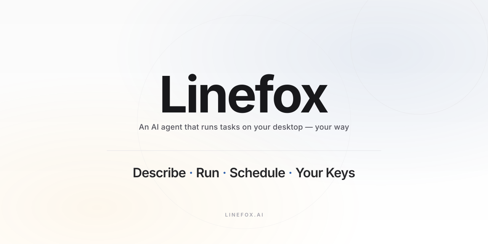
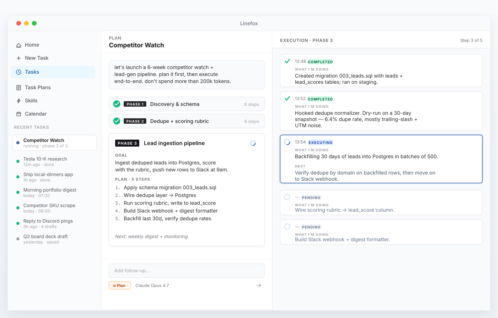
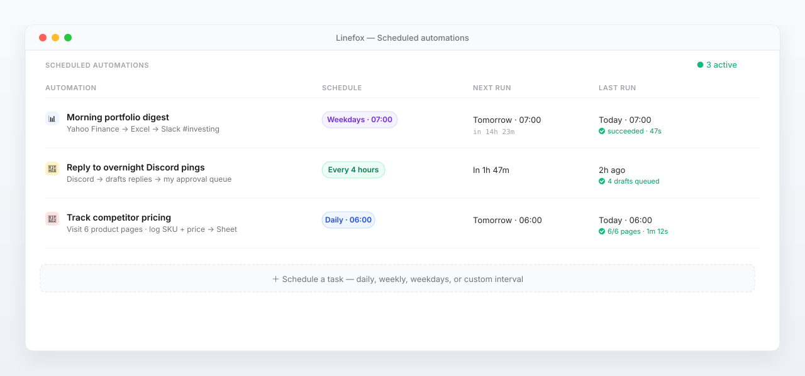
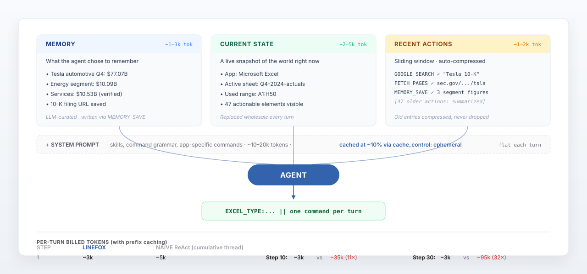

<p align="center">
  
</p>

# Linefox

**An open-source AI agent that drives your real desktop — your browser, your terminal, your spreadsheets. The agent that makes repetitive work disappear. One and done.**

Most AI tools talk to you. Linefox works *for* you. Describe a task in plain English — `"find Tesla's latest 10-K, pull segment revenue + capex into the open Excel sheet, and Slack the summary to me"` — and Linefox plans the steps, drives the real apps you already use logged-in, and reports back. No recording. No setup. No babysitting.

[**linefox.ai**](https://linefox.ai) · MIT license · macOS

## What it does

- **Drives any app on your Mac** — a combination of CLI tools, macOS accessibility APIs, and AppleScript means Linefox can run browsers, spreadsheets, document editors, dev tools, terminals. If you can use it, Linefox can run it.
- **Plans, then executes** — a two-tier agent architecture separates the *orchestrator* (decides which phase comes next) from the *executor* (does the click / type / fetch). You set the objective; the agent handles the prompting and drives toward it.
- **Direct HTTP fetch + browser as backup** — `FETCH_PAGES` grabs up to 8 URLs in parallel without ever touching Chrome (no popups, no profile interference). When a page needs a real login session, Linefox falls back to driving your actual browser.
- **Sliding memory keeps tasks long-running** — older actions are summarized and dropped, fresh context kept verbatim. Tasks run for dozens of steps without blowing your token budget on re-sent history.
- **Bring your own LLM — or your subscription** — Claude API, OpenAI API, Gemini, Grok, DeepSeek, **or sign in with your existing ChatGPT Plus/Pro or Claude Pro subscription** (no extra API bill).
- **Schedule and forget** — daily, weekly, weekdays, or custom cron. Linefox runs in the background on your machine.
- **Run from anywhere** — trigger and monitor automations from a paired Telegram or Discord bot. Hand a task to your desktop while you're out; your phone gets the result.

Everything runs locally. Your API keys, your data, your machine.

## Features at a glance

### Drives the real apps on your Mac

Not a sandboxed browser-only agent. Linefox runs your *actual* Chrome (logged-in sessions intact), your terminal, your open Excel and Word documents — the apps you already use.

<p align="center">
  
</p>

### Runs autonomously, stays on task

Phased planning (orchestrator → executor) keeps the agent anchored on the goal over dozens of steps, while the [memory architecture](#memory-architecture) below keeps per-turn token cost flat. The two together let Linefox run long tasks continuously without drifting and without burning your budget.

<p align="center">
  
</p>

### Schedule and forget

Save any automation as a script, then run it daily, weekly, weekdays, or on a custom cron. Linefox handles it locally — your desktop runs the work in the background.

<p align="center">
  
</p>

### Run from Telegram or Discord

Pair a Telegram or Discord bot and trigger automations from your phone. Your desktop does the work, the bot relays the brief and the result. Both engines ship in the box — just paste a bot token in Settings.

## Memory architecture

Most agents (Claude Code, OpenAI Codex, OpenClaw, Browser Use) accumulate every tool-call observation in a growing message thread. By step 30 you're paying to re-send every page you scraped, every click you confirmed, every terminal output you've ever seen — context that mostly mattered for one or two steps and is now just bloat. That's why long tasks get expensive and start to drift.

Linefox doesn't show the agent its history as a thread. Each turn, three **bounded** streams feed in plus one cached prompt:

<p align="center">
  
</p>

- **MEMORY** — what the agent *chose to remember*. The LLM emits `MEMORY_SAVE` for findings, decisions, key data. Typically 1–3k tokens for a 30-step task. Raw HTML, accessibility-tree dumps, click confirmations never land here.
- **CURRENT STATE** — a fresh snapshot of the world *right now*: current app, visible accessible elements, Excel sheet info, Word document info. Replaced wholesale every turn, ~2–5k tokens.
- **RECENT ACTIONS** — the last ~50 actions as compact one-liners (`CLICK:42 ✓ Submit | form opened`). When the buffer fills, oldest entries auto-compress into a single summary line (e.g. `Excel commands ×12 | Click commands ×8`) — they're never silently dropped.
- **SYSTEM PROMPT** (the only static part, ~5–8k tokens) is wrapped in `cache_control: ephemeral` and billed at ~10% via the provider's prefix cache. Effectively flat per turn.

The result: per-turn cost stays roughly flat regardless of step count.

| Step | Linefox  | Typical thread agent   |
| ---- | -------- | ---------------------- |
| 1    | ~3k tok  | ~5k tok                |
| 10   | ~3k tok  | ~35k tok (11×)         |
| 30   | ~3k tok  | ~95k tok (32×)         |

By step 30 a thread-style agent is paying **~30× more per LLM call** than Linefox, and the gap keeps widening linearly.

This isn't just cheaper — it's why long tasks actually finish. When the context isn't drowning in stale observations, the model can focus on what's on screen *now* and what it explicitly wrote down. Old clicks don't haunt the next decision. The mental model matches how a human operator works: you don't remember every click — you look at the screen and decide; the exceptions worth keeping, you write down.

## How it compares

|                                       | Linefox Desktop                                  | Claude Cowork                          | OpenClaw                              |
| ------------------------------------- | ------------------------------------------------ | -------------------------------------- | ------------------------------------- |
| Control methods                       | Accessibility + AppleScript + COM + CLI + APIs   | Screenshots + Puppeteer + CLI          | APIs where available + CLI            |
| Token efficiency                      | Text-first, compact memory                       | Screenshot-heavy                       | Varies                                |
| Model support                         | Claude, OpenAI (incl. ChatGPT login), Gemini, Grok | Claude only                          | BYO (any)                             |
| Recurring tasks with custom instructions | ✅                                            | basic schedules                        | DIY                                   |
| Command from phone                    | Telegram, Discord                                | Phone pairing                          | 15+ (Telegram, WhatsApp, Slack, Signal…) |
| Pricing                               | Free · BYO-key · ChatGPT login                   | $17–$200/mo Claude plan                | Free (BYO-key)                        |

## LLM providers

Pick one in Settings. Linefox uses the same agent loop across all of them — model choice only affects which API gets the request.

| Provider              | What it is                                                           | Key needed                                  |
| --------------------- | -------------------------------------------------------------------- | ------------------------------------------- |
| **ChatGPT subscription** | Use your Plus / Pro plan via the Codex Responses API              | OAuth sign-in (no API key)                  |
| **Claude subscription**  | Use your Claude Pro / Max plan via Anthropic's OAuth token        | `claude setup-token` (no API key)           |
| **Anthropic API**     | Claude Sonnet 4.5 / Opus via direct Anthropic API                    | `api_key_claude`                            |
| **OpenAI API**        | GPT-5 family via direct OpenAI API                                   | `api_key_open_ai`                           |
| **Google Gemini**     | Gemini 2.5 Flash via Generative Language API                         | `api_key_gemini`                            |
| **xAI Grok**          | Grok via xAI API                                                     | `api_key_grok`                              |
| **DeepSeek**          | DeepSeek Chat                                                        | `api_key_deepseek`                          |

All providers route through the same prompt-caching pipeline — long system prompts hit the prefix cache on every turn instead of being re-billed.

## Tech stack

| Layer              | Technology                                                                       |
| ------------------ | -------------------------------------------------------------------------------- |
| Desktop shell      | Tauri 2 (Rust)                                                                   |
| Backend            | Rust                                                                             |
| Frontend           | React + TypeScript + Vite                                                        |
| UI                 | Chakra UI + styled-components                                                    |
| Database           | SQLite (rusqlite + Diesel migrations)                                            |
| Vector search      | HNSW (hnswlib-rs) for skill / automation recall                                  |
| Accessibility      | macOS Accessibility API + AppleScript (Windows UIA on roadmap)                   |
| LLM providers      | Claude (API + OAuth subscription), OpenAI (API + Codex subscription), Gemini, Grok, DeepSeek |
| Remote bots        | tokio-tungstenite WebSocket bridge → Telegram & Discord engines                  |

## Build from source

### Requirements

- macOS 11+
- [Node 18+](https://nodejs.org/en/download/package-manager) (recommended via [nvm](https://github.com/nvm-sh/nvm))
- [Rust](https://www.rust-lang.org/tools/install) (stable)

### Run in dev

```bash
git clone https://github.com/pixelsmasher13/linefox_open.git
cd linefox_open
npm install
npm run tauri dev
```

If you hit dependency issues, delete `package-lock.json` and `node_modules`, then re-run `npm install`.

On first launch, grant accessibility permissions when prompted: **System Settings → Privacy & Security → Accessibility**. Then go to **Settings** and either sign in with your ChatGPT / Claude subscription or paste an API key.

### Build a release

```bash
npm install
npm run tauri build
```

Output goes to `src-tauri/target/release/bundle/macos/`.

## Architecture notes

A few of the less-obvious decisions:

- **Two-tier agent loop** — an *orchestrator* LLM (`orchestrator_prompt.rs`) decides phase transitions: continue the current phase, advance to the next, or complete. An *executor* LLM (`automation_agent_agentic_prompt.rs`) runs each phase step by step. Decoupling planning from execution means long tasks don't drift, and a stuck executor can call `PLAN` to ask for a fresh approach.
- **Action grammar** — the executor emits **one** command line per turn (`CLICK:42 || rationale`, `URL:https://...`, `EXCEL_TYPE:B3:=77073`, `FETCH_PAGES:url1,url2 || rationale`, etc.) parsed in [`action_parsing.rs`](src-tauri/src/engine/action_parsing.rs). One-command-per-turn keeps each step verifiable.
- **Parallel HTTP fetch beats browser scraping** — `FETCH_PAGES` does up to 8 concurrent HTTP gets, strips HTML to readable text, and feeds it back to the LLM. The system enforces *one fetch per URL per run* so the LLM can't loop. The browser is reserved for pages that genuinely need a logged-in session.
- **Excel via AppleScript, not UI clicking** — Excel cells are read/written through AppleScript (`excel_macos.rs`) instead of locating cells via accessibility. ~100× faster, and immune to scroll position or column width.
- **Memory manager with auto-compression** — every action goes into `memory_manager.rs`; once history exceeds the window, the oldest entries get summarized into a single `action_history_summary` block. Recent actions stay verbatim.
- **Prompt caching is the default** — both API and subscription paths wrap system prompts in `cache_control: ephemeral` blocks. A 10k-token system prompt that would cost $0.03 per turn at full price hits the cache at ~$0.003.
- **Telegram & Discord bots are first-class** — `telegram_bot.rs` and `discord_bot.rs` connect over WebSocket; the desktop runs the work, the bot just relays the brief and final result. No third-party automation server in between.

## Repository layout

```
linefox_open/
├── src/                     React frontend
│   ├── screens/             Automation, Discover, Skills, …
│   └── packages/            Shared design system + hooks
├── src-tauri/
│   ├── src/
│   │   ├── auth/            OpenAI Codex (ChatGPT subscription) OAuth flow
│   │   ├── engine/          Agent loop, providers, prompts, bots, scheduler
│   │   │   ├── llm_providers/   claude, openai, openai_codex, gemini, grok, deepseek
│   │   │   ├── app_commands/    excel_macos, word_macos
│   │   │   └── terminal/        Sandboxed terminal execution
│   │   └── window_details_collector/   macOS accessibility capture
│   ├── migrations/          Diesel SQLite migrations
│   └── tauri.conf.json
└── docs/images/             Banner + feature SVGs (this README)
```

## Contributing

PRs and issues welcome at [github.com/pixelsmasher13/linefox_open](https://github.com/pixelsmasher13/linefox_open).

## License

MIT — see [LICENSE](LICENSE).
